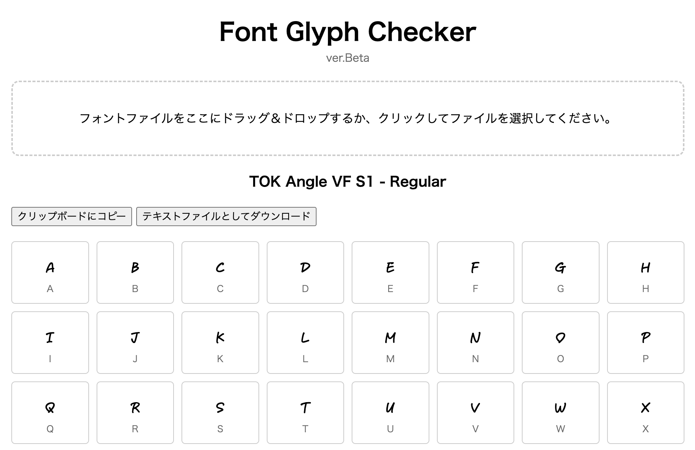

# Font Glyph Checker

A simple web tool to check the glyphs contained in a font file.

This application allows you to easily view all the characters (glyphs) included in a font file (.ttf, .otf, .woff, .woff2) directly in your browser.

## Live Demo

**You can try the application here:**

**[https://toktaro.github.io/FontGlyphChecker/](https://toktaro.github.io/FontGlyphChecker/)**

## Screenshot

## Features

- **Font File Upload**: Upload fonts via drag & drop or file selection.
- **Glyph Display**: Displays all glyphs contained in the font (excluding empty glyphs without outlines).
- **Live Font Rendering**: Renders each glyph using the uploaded font itself.
- **Copy to Clipboard**: Copies all characters as a single string to the clipboard.
- **Download as Text**: Downloads the complete character list as a `.txt` file.
- **No Server Required**: Runs entirely in the browser.

## How to Use

1.  Clone this repository or download the files.
2.  Open the `index.html` file in your web browser.

## Technologies Used

- HTML
- CSS
- Plain JavaScript
- [opentype.js](https://github.com/opentypejs/opentype.js)

## Author

- toktaro

## License

This project is provided under a custom license. See the [LICENSE](LICENSE) file for details.
